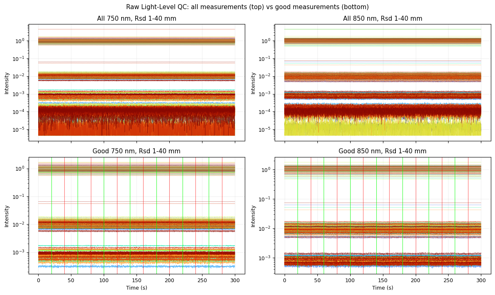
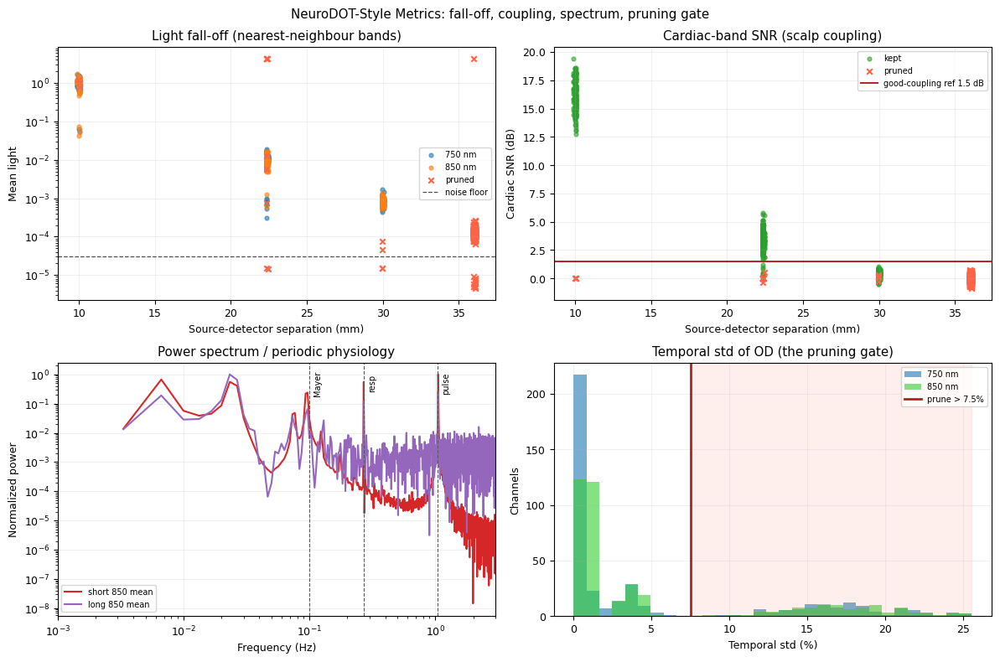
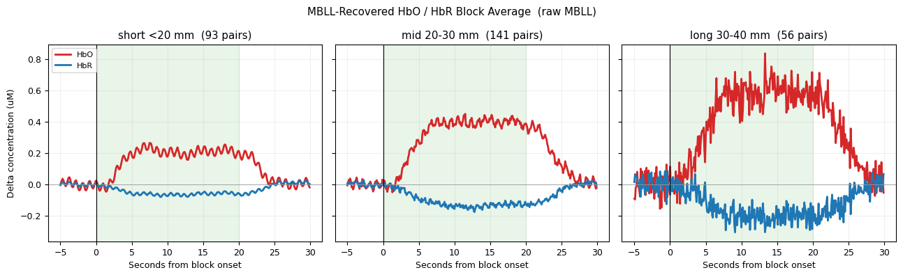
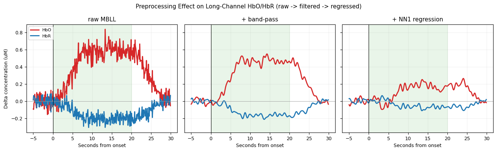

# DOT / fNIRS Signal Quality Simulator

A single-file [marimo](https://marimo.io) app that teaches the **quality-control plots**
used in high-density diffuse optical tomography (DOT) and functional near-infrared
spectroscopy (fNIRS) - the kind you meet in NeuroDOT-style preprocessing walkthroughs.

It generates **physics-based** synthetic two-wavelength (750 nm + 850 nm) data on a
**real HD-DOT cap**, lets you add artifacts one slider at a time, and shows how each QC
plot reacts. The goal is *pattern recognition*: what do motion, drift, poor coupling,
systemic physiology, bad channels, and source-detector distance actually look like on
these plots, and what does preprocessing fix?



## Why it is more than a cartoon

The whole signal chain runs through the real forward model:

- **Real cap geometry.** A 26-source / 31-detector HD-DOT montage with genuine
  nearest-neighbour separation bands (NN1 ≈ 10 mm, NN2 ≈ 22 mm, NN3 ≈ 30 mm, NN4 ≈ 36 mm).
- **Light fall-off** follows the **Farrell (1992) semi-infinite diffuse reflectance**
  solution from realistic tissue absorption/scattering, so intensity drops ~5 orders of
  magnitude with distance down to a noise floor.
- **Spectroscopy** projects haemoglobin changes (HbO, HbR) to optical density through the
  **modified Beer-Lambert law** using the real Prahl/OMLC extinction coefficients and adult
  differential pathlength factors, then **inverts** that law to recover HbO/HbR - exactly
  like a real pipeline. The forward/inverse round-trip cancels to machine precision.
- **Preprocessing** is the real thing: a zero-phase Butterworth band-pass (0.02-1 Hz) and
  short-separation (NN1) regression.

See [PHYSICS.md](PHYSICS.md) for the full model and references.

## The one idea it teaches

A measurement's **raw light quality** and its **neural-response quality** are not the same:

| Separation | Light / SNR | Cortical sensitivity | Role |
|---|---|---|---|
| **Short** (NN1, ~10 mm) | excellent, clear pulse | tiny | scalp-physiology *regressor* |
| **Mid** (NN2, ~22 mm) | good | moderate | best single-distance compromise |
| **Long** (NN3-4, 30-36 mm) | worst, prunes first | highest | cortical *workhorse* when it survives |

A channel can pass "do we have light?" and still fail "can we trust the brain signal?".
That is why QC is layered.

## Plots

| Plot | What it answers |
|---|---|
| Raw light QC (all vs good) | Do we have usable light? What does pruning remove? |
| Zoomed cardiac pulse | Is there a heartbeat (good coupling)? |
| QC metrics dashboard | The three pruning gates: fall-off, cardiac SNR, temporal-std |
| Cap view | Spatial coverage after pruning |
| OD traces / grayplot | Global events, motion stripes, bad channels |
| GVTD | Motion frames to scrub |
| HbO / HbR block average | The recovered hemodynamic response (HbO up, HbR down) |
| Preprocessing effect | What band-pass and superficial regression each fix |
| Spectrum | Where systemic oscillations live |





## Run it

```bash
pip install -r requirements.txt

# interactive app (read-only)
./run.sh                # serves on http://localhost:8765
# or
python3 -m marimo run dot_qc_simulator.py --headless --no-token --port 8765

# to edit/inspect the notebook
python3 -m marimo edit dot_qc_simulator.py
```

All controls live in the left sidebar; the plots update reactively as you move a slider.

## What to look for

Each plot has a healthy "tell" and a warning "tell". A few experiments to build intuition:

1. Preset **Motion spikes** → GVTD spikes over threshold and the grayplot shows vertical stripes.
2. Preset **Bad optode coupling** → raw-light channels fall to the noise floor and the cap view turns red.
3. Preset **Strong superficial physiology** + **NN1 regression** on → the long-channel HbO
   bump shrinks to its true cortical size (scalp signal removed) in the *Preprocessing effect* plot.
4. Preset **Pulse/respiration** + **Band-pass** on → the cardiac ripple on the HbO trace disappears.

The band-pass and regression toggles reshape the **OD, grayplot, and HbO/HbR** plots - not
the raw-light or QC-metric plots (those are raw on purpose).

## Honest limitations

This is a teaching tool, not an instrument model.

- Diffusion approximation in a **homogeneous semi-infinite medium** - no Monte Carlo / FEM,
  no layered scalp-skull-brain, no head mesh. Depth sensitivity is a smooth phenomenological
  weight, not a true photon-measurement-density Jacobian.
- The cap is the real piglet pad but **flattened to 2D**; there is no image reconstruction.
- MBLL assumes a **single homogeneous compartment**, so recovered HbO/HbR mix cortical and
  scalp signal - which is exactly why short-separation regression matters here.
- DPF values are **adult-head** (~6.4 / 5.75); a piglet head has a shorter photon path, so
  absolute HbO/HbR magnitudes would scale (the QC plot *shapes* are unaffected).
- Physiology is synthetic (sinusoids + a canonical HRF); block averaging is idealised.

Use it to train your eye on shapes and failure signatures, then trust real data and a real
pipeline (NeuroDOT, Homer3, NIRFASTer / Monte Carlo for the forward model) for anything
quantitative.

## Credits

- QC-plot conventions follow the NeuroDOT processing/analysis workflow.
- Hemoglobin extinction coefficients: S. Prahl, OMLC tabulation.
- Diffuse reflectance: Farrell, Patterson & Wilson, *Med. Phys.* 19 (1992).

## License

MIT - see [LICENSE](LICENSE).
